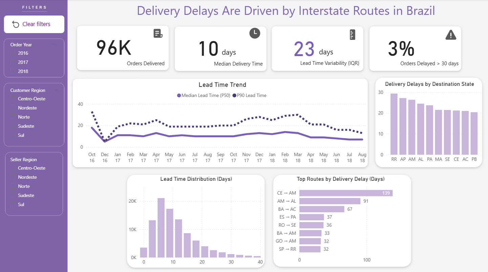

# Hi there 👋 I'm Vitória Ceccato

🎯 Data Analyst | Power BI | SQL  

📊 Transforming data into business decisions  

🌍 Open to remote opportunities (Brazil & International)

---

## 🚀 About Me

I am a Data Analyst with strong focus on SQL and Business Intelligence, continuously improving technical depth and business impact.

- SQL for data analysis
- Power BI dashboards
- Data modeling fundamentals
- Business-driven insights

Currently improving:
- Advanced DAX
- Data modeling best practices
- Statistical foundations

---

## 🛠 Tech Stack

SQL | Power BI | DAX | Excel | Git | GitHub  

---

## 📂 Featured Projects

### 📊 Olist Logistics Delay Analysis

- Investigated structural drivers of delivery delays in Brazil’s Olist marketplace
- Route-level analysis revealed transport stage as the main logistics bottleneck
- Interstate routes increase extreme-delay probability by ~9x
- Developed a data-driven framework to prioritize high-impact delivery routes
- Tools: Power BI • SQL • Logistic Regression
- Business impact: identifies where logistics teams should focus resources to reduce delivery delays

---

## 📫 Contact

LinkedIn: https://www.linkedin.com/in/vitoriaceccato/
